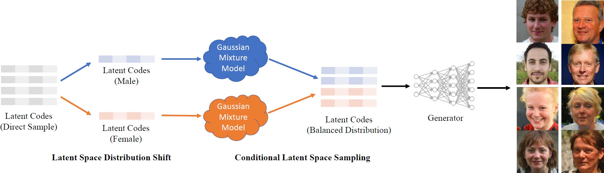
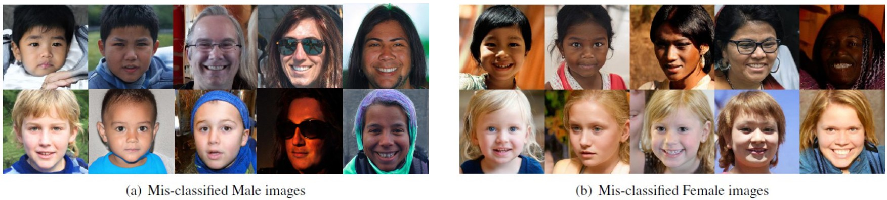
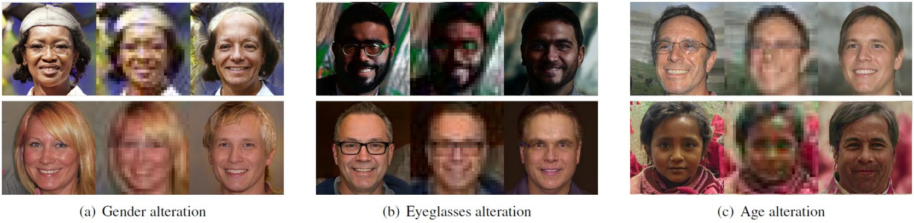

# FairGen - Improving the Fairness of Deep Generative Models without Retraining


**Figure:** *Framework of FairGen*.

> **Improving the Fairness of Deep Generative Models without Retraining** <br>
> Shuhan Tan, Yujun Shen, Bolei Zhou <br>
> *arXiv preprint arXiv:2012.04842*

[[Paper](https://arxiv.org/pdf/2012.04842.pdf)]
[[Project Page](https://genforce.github.io/fairgen/)]
[[Colab](https://colab.research.google.com/drive/1_k45KPpLP0xMqC8AjmUFerqdDCbkwN1l?usp=sharing)]

In this repository, we propose a simple yet effective method to improve the *fairness* of image generation for a pre-trained GAN model *without retraining*.
We utilize the recent work of *GAN interpretation* and a *Gaussian Mixture Model (GMM)* to support the sampling of latent codes for producing images with a more fair attribute distribution.
We call this method *FairGen*.
Experiments show that *FairGen* can substantially improve the fairness of image generation. The images generated from our method are further applied to reveal and quantify the biases in commercial face classifiers and face super-resolution model. Some results are shown as follows.


## Fair Image Generation

Attributes: Age-Eyeglasses


Attributes: Gender-Black Hair


## Identifying Bias in Existing Models

Mis-classification in Commercial Gender Classifiers


Attribute Alternation by a Face Super-resolution Model


## BibTeX

```bibtex
@article{tan2020fairgen,
  title   = {Improving the Fairness of Deep Generative Models without Retraining},
  author  = {Tan, Shuhan and Shen, Yujun and Zhou, Bolei},
  journal = {arXiv preprint arXiv:2012.04842},
  year    = {2020}
}
```

## Code Coming Soon